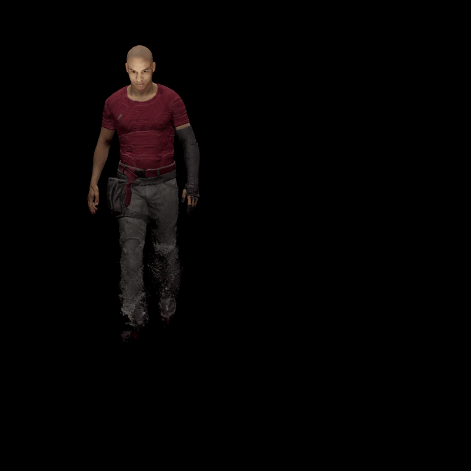
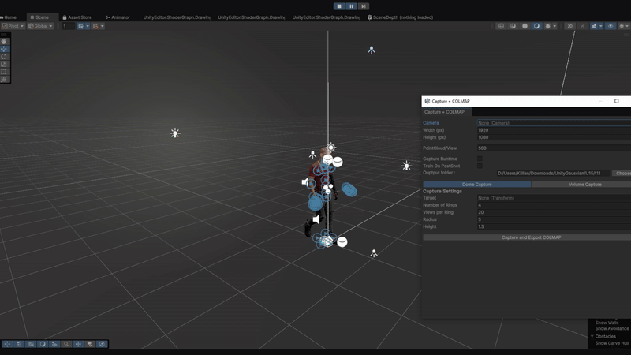

# 🎥 UnityGaussianCapture

**UnityGaussianCapture** is a Unity editor tool designed to capture 3D scenes and export data for neural rendering pipelines such as **Gaussian Splatting** and **4DGS**. It provides a streamlined interface for scene capture, sequence recording, and automated training.

---

## ✨ Features

- 🖼️ **Transparent rendering support**
- 🎞️ **Sequence recording for 4DGS**
- 🤖 **Automatic PostShot training after capture**
- 🧩 **MeshCollider generation and refresh for SkinnedMeshRenderers** (for point cloud creation)
- 📦 **Export formats**: `.psht`, `.ply`
- 🧪 **Training profiles**: `Splat3`, `MCMC`, `ADC`
- 🌀 **Dome Capture** and 🧊 **Volume Capture** modes

---

## 🧰 UI Overview

### 🎛️ Camera Settings
- **Camera**: Select the Unity camera used for capture
- **Resolution**: Width and height in pixels
- **PointCloud/View**: Number of points per view

### ⏱️ Capture Runtime
- **Enable Runtime Capture**
- **FPS / Duration**: Control frame rate and capture length
- **Train On PostShot**: Automatically launch training after capture
- **PostShot CLI Path**: Path to `postshot-cli.exe`
- **Training Steps**: Number of training iterations

### 💾 Output Format
- Choose between `.psht` and `.ply`

### 🧪 Training Profile
- Select from `Splat3`, `MCMC`, or `ADC`

### 📁 Output Folder
- Choose the destination folder for exported data

---

## 🌀 Dome Capture

Capture views around a target using a dome configuration:

- **Target**: Transform to orbit
- **Number of Rings**
- **Views per Ring**
- **Radius**
- **Height**

---

## 🧊 Volume Capture

Capture views within a 3D volume grid:

- **Volume Center**: X, Y, Z coordinates
- **Volume Size**: Dimensions in X, Y, Z
- **Subdivisions**: Number of grid divisions along each axis
- **Show Grid**: Toggle grid visualization

## 📦 Installation (via Unity Package Manager)
You can install UnityGaussianCapture directly from GitHub using Unity's Package Manager.

- Open your Unity project.
- Go to Window → Package Manager.
- Click the + button (top-left) → Add package from Git URL...
- Paste the following URL:
https://github.com/KillianCartelier/UnityGaussianCapture.git
- Click Add. Unity will fetch and install the package.

---

## 🚀 Usage

1. Add the `Camera Dome Gizmo` component to a GameObject.
2. Add `Mesh Collider` component to objects you have in your scene.
3. Configure camera, capture mode, and output settings (If you want to export a sequence, you need to hit play and pause).
4. Click **Capture and Export COLMAP** to start the process.
5. If enabled, PostShot training will launch automatically.
6. Once the training is done, you can close the terminal window.

---

## 🛠️ Requirements

- Unity 6.x
- [PostShot](https://jawset.com/postshot) (optional, for training)
- Editor Coroutines Package (com.unity.editorcoroutines)
