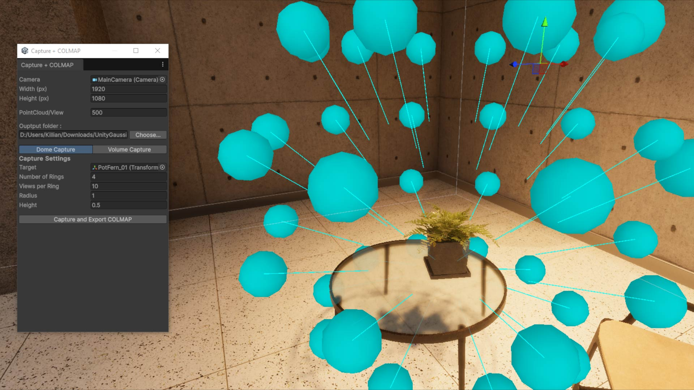
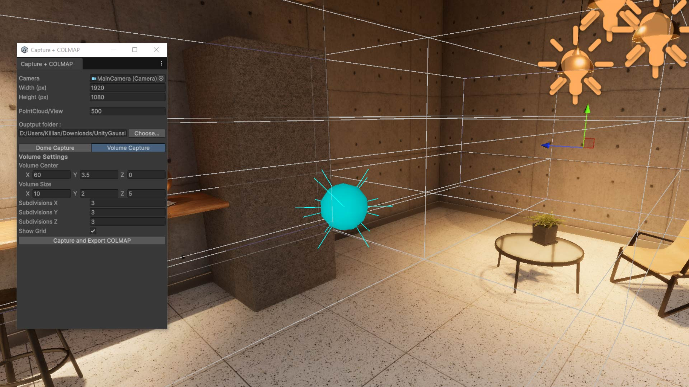

# UnityGaussianCapture

## Introduction
**UnityGaussianCapture** is a Unity editor tool designed to capture views from a 3D scene for use in **Gaussian Splatting** pipelines. It exports data in a format directly compatible with tools like **PostShot**, eliminating the need for COLMAP.

## Features

### Dome Capture

- Captures spherical views around a target object.
- Configurable parameters:
  - Number of rings
  - Views per ring
  - Radius
  - Height

### Volume Capture

- Captures views within a defined 3D volume.
- Configurable parameters:
  - Volume center (X, Y, Z)
  - Volume size (X, Y, Z)
  - Subdivisions (X, Y, Z)
  - Grid visualization toggle

### Result

Trained on PostShot 15M Splats

## Installation

1. Clone this repository:

        bash
        git clone https://github.com/KillianCartelier/UnityGaussianCapture.git

2. Open your Unity project.

3. Drag the CameraDomeGizmo.cs file and `Editor` folder into your project.

## Usage

1. In your Unity Scene, add the component CameraDomeGizmo to an empty GameObject.
2. In Unity, open the **Capture + COLMAP** window from the menu.
3. Choose a capture mode:
   - **Dome Capture** for spherical sampling around an object.
   - **Volume Capture** for structured sampling in a 3D space.
4. Adjust the parameters to fit your scene.
5. Click **Capture and Export COLMAP** to generate the dataset.

> 💡 The exported files are directly compatible with **PostShot** and other Gaussian Splatting pipelines – no need to run COLMAP!

## Requirements

- Unity 6 (may work with previous versions but not tested yet)
- A scene with an active camera  

## To-Do

- [ ] Add support for capturing frames from animations (for future 4D Gaussian Splatting training)

## License

This project is licensed under the MIT License.

## Contributing

Contributions are welcome! Feel free to:

- Open issues for bugs or suggestions  
- Submit pull requests with improvements  
- Share your use cases and feedback
